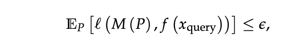

# What Can Transformers Learn In-Context? A Case Study of Simple Function Classes

## Overview
problem addressed: in-context learning on function classes, the ability of transformer models to learn contextual information when processing linear functions

Approach: Empirical Approach, train transformers from scratch and compare to the optimal least square estimator, sparse linear functions, two-layer neural networks, and decision trees. 

## Introduction
In-context learning refers to the ability of a model to condition on a prompt sequence consisting of in-context examples (input-output pairs corresponding to some task) along with a new query input, and generate the corresponding output (without the need to perform any parameter updates after the model is trained).
Here a model in-context learn a function class F, for “most” functions f ∈ F, and approximate f(xquery) by conditioning on a prompt sequence (x1, f(x1),..., xi, f(xi), xquery) containing in-context examples and the query input.

Let Dx be a distribution over inputs in 20 dimensions, e.g. linear functions: isotropic Gaussian distribution N(0, Id),
and DF be a distribution over functions in F, e.g. linear functions:the distribution over linear functions with weight vectors drawn from an isotropic Gaussian (N(0, Id), setting f(x) = w⊤x.
Inputs xi and xquery, f are drawn i.i.d from their distributions over Dx and DF.

We say that a model M can in-context learn the function class F up to ε, with respect
to (DF , DX ), if it can predict f (xquery) with an average error

where l(·, ·) is some appropriate loss function, such as the squared error.

### Question 1: method to minimize the expected loss? hint: name some loss function?

### question 2: How to evaluate the ability of the transformer model to generalize to unseen functions? hint: reflect on how we sample our input data.

## Model architecture
**Model: decoder-only Transformer architecture from the GPT-2 family**

**Input: P =(x1,f(x1),x2,f(x2),...,xi,f(xi),xi+1)**

**Output: Mθ(xquery), a sequence of vectors then map the vector produced by the model to a scalar** 

**Parameter: θ includes 12 layers and 8 heads**

**for each layer:**
**-forward pass: prediction of the model at the position corresponding to xi (that is absolute position 2i − 1) as the prediction of f(xi).**

## Training
- step 1: at each training step, sampling a batch of prompt
- step 2: model Mθ aiming to minimize the expected loss over prompt, updating the model through a gradient update (we use a batch size of 64 and train for 500k total steps)
- step 3: compare with baseline: a)the least squares estimator, computing the minimum-norm linear fit to the in-context examples (xi, yi), (b) n-Nearest Neighbors, averaging the yi values for the n nearest neighbors of xquery, (c) averaging the values yixi to estimate w and compute the inner product of this estimate with xquery. 

## Extrapolating beyond the training distribution
1. sampling prompt inputs or functions from a different distribution, that is Dtrain ̸= Dtest X/F X/F
2. introducing a mismatch between in-context examples and the query input, that is Dtest

## Critical Ananlysis
While the paper does not provide any explanation for why transformers exhibit such capabilities, it will spur both empirical and theoretical work studying how transformers learn algorithms from in-context examples
capability of transformers model to deduce what function the context refers to and execute/compute the value of that function given an input in the context.

There's a lot of mentioning for 'in-context'. However, I do fear that this could be a bit misleading. All the model is doing is doing sequential modeling that given a series of inputs and the corresponding function values, the model predicts the function value of the previous input. So in a way this can also be seen as sequence modeling.

corresponding to predicting on sequences that consist of examples from some tasks. These sequences have more structure and thus this behavior/capability has been studied separately in the literature under the name of "in-context learning"

How is it [the input] presented to the model?
The Transformer architecture takes as input a sequence of vectors in its embedding space and predicts the next vector in the sequence within the same embedding space (in language modeling these vectors correspond to input tokens). We apply this architecture to our prompt format of

as follows. We map each prompt output

to the same dimension as prompt inputs

by appending zeros, and map the prompt inputs and outputs into the embedding space of the Transformer through a (learnable) linear transformation. We then use another (learnable) linear transformation to map the vector produced by the model to a scalar. Note that the Transformer architecture allows us to compute the prediction for all prompt prefixes in a single forward pass. We will edit our manuscript to clarify any confusion.
## other links

